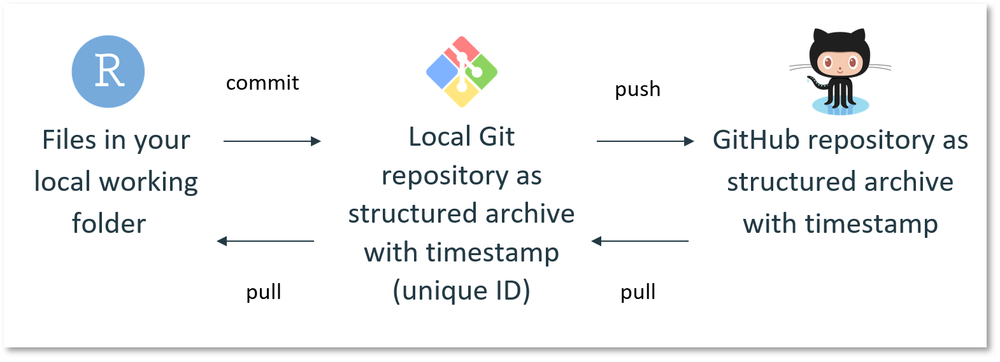

```{r setup, include=FALSE}
knitr::opts_chunk$set(echo = TRUE)
```

```{r packages, include=FALSE}
library(dplyr)
```

# Introduction

The Epidemiology team aims to harmonise its R coding style and practices across projects.

This document describes the style that we aim to apply. It is based on <https://style.tidyverse.org/index.html>, initially derived from Google's original R style guide <https://google.github.io/styleguide/Rguide.html>.

But of course, this document is and will always be ***work in progress***. We hope to regularly add more details, possibly re-adjust some rules, include new topics, etc.

The most important thing about such a guide is that it provides consistency and harmonisation. Making code easier to read will also allow to focus on the content. Some decisions described in this guide are driven by the wish to keep our R code as simple as possible. Non-R users should be able to read and understand our R code.

If you have any suggestion to this guide, please feel free to share them to the team at [strap\@epiconcept.fr](mailto:strap@epiconcept.fr)

# Syntax

## Assignment

Proper assignment `<-` is preferred over the equal sign `=`. Never use the right assignment `->`:

```{r}
# Good
results <- mean(iris$Sepal.Length)

# Bad
results = mean(iris$Sepal.Length)
mean(iris$Sepal.Length) -> results
```

Variable name and assignment should be on the same line:

```{r}
# Good
iris_sepal <- iris %>%
  dplyr::select(Species, Sepal.Length, Sepal.Width) %>% 
  dplyr::arrange(-Sepal.Length) 

# Bad
iris_sepal <- 
  iris %>%
  dplyr::select(Species, Sepal.Length, Sepal.Width) %>% 
  dplyr::arrange(-Sepal.Length) 
```

## Naming

### Variables

Use `CamelCase` for variable names (similarly to ECDC data warehouse format).

```{r}
# Good
DayOne <- 1

# Bad
first_day_of_the_month <- 1
djm1 <- 1
```

### Globals

Global variables and constants should be in `UPPERCASE` and `snake_case`:

```{r}
# Good
COUNTRY_CODE <- c("CZ", "ES", "FR", "IT", "NO")
VACCINE_DELAY <- 14
```

### Functions

Use a special `camelCase` for function names (first letter in lower case) and `lower case` for its arguments.

Because your function should reflect an action, start your function name with a verb (see also the fllowing section [Function name]).

```{r}
# Good
doNothing <- function(x, y) {
  return()
}

# Bad
do_nothing <- function(x, y) {
  return()
}
```

### Files

All file names should be in lower case: datafile, scripts, log files, image files, other output files. Some OS are not case sensitive and this could lead to unexpected issues.

The extension can mix case to respect R standards: `.R` extension for scripts, `.RData` extension for data. If needed `use_snake` case to separate words

```{r, eval=FALSE}
# Good
do_nothing.R

# Bad
doNothing.R
```

## Packages

Strive to use *as less packages as possible* to avoid endless dependencies. Indeed, R packages are, most of the time, maintained by one person only and on a voluntary basis. On top of that, the CRAN sends maintenance requests quite often to maintainers and is quite strict: maintainers only have a few days to update their packages before they get archived. Therefore, several R packages disappear from the CRAN on a regular basis.

Explicitly specify package name (i.e., namespaces) when calling a function. Several R packages use sometimes the same function names and this may lead to conflicts between functions/packages and to unexpected error messages. To check for conflicts between objects, see `conflicts(detail = TRUE)`.

```{r}
# Good
IrisSepal <- iris %>%
  dplyr::select(Species, Sepal.Length, Sepal.Width) %>% 
  dplyr::arrange(-Sepal.Length) 

# Bad
IrisSepal <- iris %>%
  select(Species, Sepal.Length, Sepal.Width) %>% 
  arrange(-Sepal.Length) 
```

## Pipe `%>%`

Pipes can be used but with parsimony. Don't use them for short assignments (one line).

```{r}
# Good
Species <- iris$Species

# Bad
Species <- iris %>%
  dplyr::pull(Species)
```

Try to avoid to use them for very long assignments. Store intermediate results when possible. This can also help to check your code step by step (keep in mind to give meaningful names even for intermediate results).

Don't use the "in place pipe" `%<>%` as it requires another package and is not widely used.

```{r}
# Good
iris <- iris %>%
  dplyr::select(Species, Sepal.Length, Sepal.Width) %>% 
  dplyr::arrange(-Sepal.Length)

# Bad
iris %<>%
  dplyr::select(Species, Sepal.Length, Sepal.Width) %>% 
  dplyr::arrange(-Sepal.Length)
```

# Functions {#functions-1}

## Function name

A function must reflect an action. Therefore, strive to use verbs for function names. Ideally, try to be consistent and use `camelCase` for function name, and `lower case` for its arguments (see also the section above [Functions](#functions-1)).

## Return

Use explicit returns. Do not rely on R's implicit return feature. It is better to be clear about your intent to `return()` an object.

```{r}
# Good
add2Values <- function(x, y) {
  return(x + y)
}

# Bad
add2Values <- function(x, y) {
  x + y
}
```

## Call

Please always specify the name of the arguments when calling a function so that you do not rely on the order of your unnamed arguments.

Additionally, it makes the code easier to read, specially if the R user is not familiar with the function you use. And it might allow to avoid unexpected issue if the function evolves with additional arguments with a different order (even though this might be quite unlikely from R packages authors).

```{r}
library(tidyr)
# Example dataset from WHO Global Tuberculosis Report
# including counts of new TB cases recorded by group (see ?who)
who[1:6, 1:8]

# Good
who %>% tidyr::pivot_longer(
  cols = new_sp_m014:newrel_f65,
  names_to = "variable",
  values_to = "value"
)

# Bad
who %>% tidyr::pivot_longer(
  new_sp_m014:newrel_f65,
  "variable",
  values_to = "value"
)
```

# Code documentation

There are two types of comments. Those which help to structure the code (header, section break) and those which explains your code and what you are doing.

## Structure

Add sections to structure your scripts and make it easier to navigate from chunk to chunk (shortcut: `Ctrl + Shift + r` for PC or `Cmd + Shift + R` for Mac). Use sub-headings as much as necessary.

This also allows the use of the RStudio tree view for navigating your code (see `Outline` button).

```{r}
# 0 - Script information --------------------------------------------------

# 1 - R packages ----------------------------------------------------------

# 2 - Import data ---------------------------------------------------------

## 2.1 - Case-based -------------------------------------------------------

## 2.2 - Aggregated -------------------------------------------------------

```

Use a standard header when you create a R script (see the section [R Studio snippets] for [epihead]) .

Please add a final header including the name of your script to mark the end of it. It helps to know which script has run properly until the end.

```{r}
# END of main.R -----------------------------------------------------------
```

## Comments

Add comments to your code! Uncommented code will be very difficult to maintain. Insert simple comments (no section) before every chunk of code.

```{r}
# Renaming variable 
```

They should mainly explain **why** you are doing something. Comments are there to help people who do not know your project to understand your objectives. You don't need to explain the R syntax except for tricky constructions.

```{r}
# Bad
# Renaming variable
```

```{r}
# Better
# Renaming variable according to the data dictionary stored in 'whatever_data_disctionnary.csv'
```

Another example:

```{r}
# Bad
# Checking data
```

```{r}
# Better
# Checking for incorrect date format in vaccination dates to build list of inconsistencies (sent to country)
```

# R Studio snippets

Snippets are shortcuts designed to insert code into your scripts (e.g., `lib` snippet keyword will paste the code `library(package)` in your script or R console).

Using snippets will allow you to have harmonised pieces of script/code and to avoid copy/paste from one project to another. This is particularly useful to ensure harmonised informative headers in our scripts.

## How to install them?

In R Studio, go to "Tools" in the menu, then "Edit Code Snippets" options. It will open an editor containing a file with a list of all the snippets already defined (probably the default from RStudio). Copy the code of the desired snippet, such as the [epihead] snippet below. Paste it at the end of the snippets list.

## Caution

In the snippet editor, the keyword should be inserted at the beginning of the line. Then, all the following snippet declaration should be indented with one space. If you get any red squares (i.e., indentation being highlighted in red) in the snippet declaration, select the snippet code with wrong indentation, press `Shift + Tab` to remove any indentation, and press `Tab` to add the proper final indentation.

If some snippets already exists in the snippet editor, remove them before pasting the new one.

## How to add them in a script?

Write the name of the snippet (i.e., the snippet keyword) you want to include in the script (ex: epihead). Press `Tab` or `Enter`. The code saved in the corresponding snippet will be pasted in your script.

## Useful snippets

### `epihead`

**Aim:** To insert a standard informative header (you can put it at the top of each script)

Code to be inserted into snippets file:

    snippet epihead
      # Project Name : 
      # Script Name  :
      # GitHub repo  : 
      # Summary      : 
      # Date created : 
      # Author       : 
      # Date reviewed:
      # Reviewed by  :
      
      # Description -------------------------------------------------------------
      #' 
      
      # Changes Log -------------------------------------------------------------
      #' 
      
      # START of SCRIPT  --------------------------------------------------------
      
      # END of SCRIPT  ----------------------------------------------------------

### `todo`

**Aim:** To insert a standardised "to do" marker.

Code to be inserted into snippets file:

    snippet todo
      # -------------------------------------------------------------------------
      # Todo : ${1:todo}
      # -------------------------------------------------------------------------

## Example of snippet use

```{r}
# Project Name : I-MOVE-COVID-19
# Script Name  : restriction flowchart countries surveillance.do
# Summary      : Flowcharts that show the original data received, and the restrictions to the final data
# Date created: August 2020
# Author       : Esther Kissling
# Date reviewed:
# Reviewed by  :

# ---------------------------------------------------------------------------------------------
# Description : 
# This do-file displays the original data received by country and shows all the records dropped
# due to restrictions until the final dataset.
# While really this is an analysis do-file, it is used for data validation, so we keep it here
# (for the moment).
# The output automatically goes to the Excel spreadsheet "Restrictions flowchart surveillance.xlsx" - 
#   in the folder Excel/data validation 
# 


# ---------------------------------------------------------------------------------------------
# Log version : 

```

# R package development

When working on the development/improvement of an R package, just a few rules to keep in mind:

1.  Always create informative, easy to read, comprehensive **help page** for each function or dataset that you create. R help pages are often criticised for being uninformative. Prove them wrong! :)
2.  Always adjust the **`NEWS.md`** according to your modifications.
3.  Strive to add some **automated tests** for any new function that you may include in the package.

## Help page with `roxygen2` package

You can insert a roxygen skeleton using the following R Studio keyboard shortcut: place your cursor anywhere in the function that you wish to document and press `Alt + Ctrl + Shift + r`.

The roxygen skeleton below will automatically be pasted above your function:

```{r, eval=FALSE}
#' Title 
#'  
#' @param x  
#' @param y  
#' 
#' @return 
#' @export 
#' 
#' @examples
myFunction <- function(x, y) {
  return()
}
```

For those who want to go further, you can also create a dedicated snippet if you wish a roxygen skeleton more complete (see section [R Studio snippets]).

Some nice guidelines available here: <https://r-pkgs.org/man.html>.

## `NEWS.md` file

The `NEWS.md` file is aimed at existing package users to list all changes done in each release of the R package. To ensure harmonisation and consistency, please try to follow the structure below:

-   **First level**, specify the version of your package including these changes, and the date of the corresponding CRAN release.
-   **Second level**, gather the changes par type:
    -   Bug fixes
    -   New functions
    -   New features
    -   Deprecated functions/features
-   **Third level**, create one bullet point for each changes done in the package and detail them as much as possible.

You can place the `NEWS.md` file in the root directory or in the `/inst` folder of your package, so that it is easily accessible when your package is installed.

Please find an example from an Epiconcept R package `NEWS.md` file here: <https://github.com/Epiconcept-Paris/EpiReport/blob/master/inst/NEWS.md>.

The `NEWS.md` file will then appear on the CRAN as a nice HTML page: <https://cran.r-project.org/web/packages/EpiReport/news/news.html>.

You can use `usethis::use_news_md()` to initiate the `NEWS.md` file.

## Test with `testthat` package

To include automated tests in your package, we will use the `testthat` package.

Some guidelines available here: <https://r-pkgs.org/testing-basics.html>.

# Git and GitHub

The Epidemiology team developed a nice guide available for Epiconcept accounts on Google Drive here: <https://docs.google.com/document/d/1Pjy1fc52UUd63VswKXFFFqvSmCtcjPXNSgeS8XHj6As/edit?usp=sharing>.

Additional references: <https://happygitwithr.com/>.

## In a nutshell...

**Git** is a version control system, which means that it will:

-   Track changes in your code over time (who, when, what)
    -   Which will make it easier to find bugs in the code
-   Allow to revert any changes in the code
-   Allow collaborative development
-   Users keep the code on their machine
-   Push/pull changes from/to remote server when needed
    -   *Good practice*: push/pull should be done quite often to avoid conflicts

**GitHub** is a remote version of your local Git:

-   It is safer
-   It allows shared access
-   You can access your work from everywhere

To secure our R scripts (track/revert changes), and to allow collaborative development, we will use a version control system and follow the **workflow** below:



**Repository** also called 'repo':

-   One repo for each R project
-   It is a collection of all the files of the project
    -   Personal data, access information, passwords should not be pushed to GitHub (see .gitignore file)
-   It includes all the history of those files (who, when, what)
-   "Public" or "Private" repository: if public, your work will be publicly accessible to anyone online.
    -   Use Epiconcept GitHub workspace and private repositories to ensure privacy.

**Clone** an existing repository to download all available files locally on your computer.

**Commit** any changes you make on a regular basis:

-   'I commited' / 'I made a new commit': creating a new snapshot of the project
-   A commit is like a batch of changes in your code with which you are happy
-   It contains who, when, what changed since the latest version
-   The commit message is crucial, it is the title of the corresponding batch of changes
    -   Need to be detailed enough, but not too long

    -   Use the proper keywords

    -   *Some examples*

        -   *"Recoding of VaccStatus changed because of change in the country strategy, minimum delay between two doses is now 14 days"*
        -   *"Parameters added to printIDCond() function to suppress message if no records satisfy the condition"*

**Push** your changes to GitHub:

-   Your commit stays locally on your computer
-   Pushing is the process of adding your local changes gathered within a commit to the remote repository on GitHub

Remember to regularly **pull** any modified files available on GitHub that have not been updated locally on your computer yet:

-   It is the process of downloading commits that do not exist on your computer, from the remote repository (e.g., including work done by others, or by yourself on a different computer)
-   If you are working with other collaborators on the same project, you need to pull the latest version of the project available on its GitHub repository quite often

When more than one person is working one the same project, it is recommended to use **branches**:

-   A branch is the recommended place to work
    -   The 'main' branch (default) is usually where you have the living project
    -   The other branches are usually where the work in progress is (i.e., WIP)
-   They allow us to keep the 'main' branch working while preparing a new version
-   If something goes wrong, just cancel the branch
-   When you are happy with your changes, merge your work with the main branch through a **pull request**
-   A branch is like a *parallel adventure* starting from the last commit, i.e., last version of your project
-   You can create more than one branch
-   Each branch can evolve independently

## GitHub account

Epiconcept GitHub usernames must follow the following syntax: `epi-XXX` replacing `XXX` with your personal trigram.

*Examples:*

-   John Snow: `epi-jsw`
-   Louis Pasteur: `epi-lpr`
-   Hadley Wickham: `epi-hwm`

## Setting up R Studio for GitHub

In a nutshell, the steps to follow in order to set up Git / GitHub with R Studio are the following:

-   Creating a GitHub account (<https://github.com/>)
-   Installing Git (<https://git-scm.com/downloads>)
-   Setting up the connection between your R Studio / Git / GitHub.
    -   Setting GitHub account in R Studio

    -   Setting GitHub encrypted personal access token (PAT)

Please follow the R script `setupgit.R` (also available [here](https://drive.google.com/file/d/1bNi8clyORx7R2uL-cFMEpWLdzo7wjfgU/view?usp=share_link)) below to set your GitHub in R Studio:

```{r, eval=FALSE}
# Please make sure that
#      - You have a personal GitHub account (e.g., epi-jsw)
#      - Git is installed on your computer

# 0. Packages needed
library(usethis)
library(credentials)

# 1. Set your GitHub username and email in R Studio
usethis::use_git_config(user.name = "epi-jsw", 
                        user.email = "j.snow@epiconcept.fr")

# 2. Create a personal access token for authentication
# The next command will open GitHub in a browser
# Please log in your GitHub account 
# Create a Personal Access Token (PAT) and copy it (ideally, save it in your passbolt)
usethis::create_github_token() 

# 3. Set your PAT in RStudio with the command
credentials::set_github_pat("ghp_bkfpdlHFD5Vtmxgf6NXkJy0jxM")

# 4. Restart R!!!

# 5. Check that everything went well
usethis::gh_token_help() 
# Or with (for more inforation on your account)
usethis::git_sitrep()
```

```{r, echo=FALSE}
usethis::gh_token_help() 
```

```{r, eval=FALSE}
# Note: if something went wrong, 'gitcreds' better manages PAT conflicts
library(gitcreds)
gitcreds_get()
gitcreds_set()
```

## Basic recommendations

-   Always start working in RStudio with a pull first, in order to get the latest version of the code from the remote repository
-   Do frequent commits to trace your work
    -   Remember, the commit message is important and should be informative
-   Push regularly to inform others about your work, even if still 'work in progress'
    -   Commit message could contain 'WIP', to inform them that code is not functional yet
-   Careful to the files you push to GitHub!! Make sure that password, access information, personal data are not pushed and made available on GitHub
    -   Strongly unrecommended to push data files to GitHub (csv, RData, dta, etc.)
    -   See .gitignore file to identify files that will be ignored by GitHub
-   If more than one person is working one the same project it's recommended to use branches
    -   Name your branch with the current work you are doing in the project (e.g. "excel_outputs")

# Conclusion

Thank you for making it up to the end of this guide!! But remember... this is just a guide, it was not developed to cause us more problems than it solves ! A guide is here to help as much as possible, it is not an absolute ! If following these rules seems difficult, then we could/should re-evaluate them. Please share your feedback and ideas to the team at [strap\@epiconcept.fr](mailto:strap@epiconcept.fr)

And have fun !
