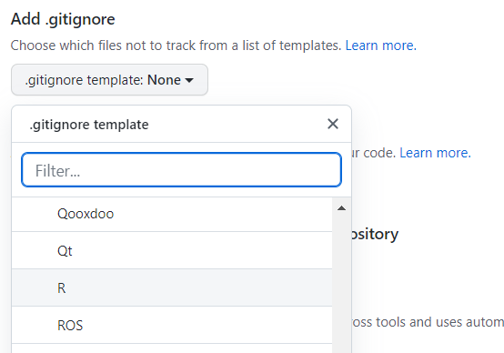
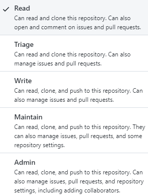

```{r setup, include=FALSE}
knitr::opts_chunk$set(echo = TRUE)
```

```{r packages, include=FALSE}
library(dplyr)
```

# Introduction

The Epidemiology team aims to harmonise its R coding style and practices across projects.

This document describes the style that we aim to apply. It is based on <https://style.tidyverse.org/index.html>, initially derived from Google's original R style guide <https://google.github.io/styleguide/Rguide.html>.

But of course, this document is and will always be ***work in progress***. We hope to regularly add more details, possibly re-adjust some rules, include new topics, etc.

The most important thing about such a guide is that it provides consistency and harmonisation. Making code easier to read will also allow to focus on the content. Some decisions described in this guide are driven by the wish to keep our R code as simple as possible. Non-R users should be able to read and understand our R code.

If you have any suggestion to this guide, please feel free to share them to the team at [strap\@epiconcept.fr](mailto:strap@epiconcept.fr)

# Syntax

## Assignment

Proper assignment `<-` is preferred over the equal sign `=`. Never use the right assignment `->`:

```{r}
# Good
results <- mean(iris$Sepal.Length)

# Bad
results = mean(iris$Sepal.Length)
mean(iris$Sepal.Length) -> results
```

Variable name and assignment should be on the same line:

```{r}
# Good
iris_sepal <- iris %>%
  dplyr::select(Species, Sepal.Length, Sepal.Width) %>% 
  dplyr::arrange(-Sepal.Length) 

# Bad
iris_sepal <- 
  iris %>%
  dplyr::select(Species, Sepal.Length, Sepal.Width) %>% 
  dplyr::arrange(-Sepal.Length) 
```

## Naming

### Variables

Use `CamelCase` for variable names (similarly to ECDC data warehouse format).

```{r}
# Good
DayOne <- 1

# Bad
first_day_of_the_month <- 1
djm1 <- 1
```

### Globals

Global variables and constants should be in `UPPERCASE` and `snake_case`:

```{r}
# Good
COUNTRY_CODE <- c("CZ", "ES", "FR", "IT", "NO")
VACCINE_DELAY <- 14
```

### Functions

Use a special `camelCase` for function names (first letter in lower case) and `lower case` for its arguments.

Because your function should reflect an action, start your function name with a verb (see also the following section [Function name]).

```{r}
# Good
doNothing <- function(x, y) {
  return()
}

# Bad
do_nothing <- function(x, y) {
  return()
}
```

### Files

All file names should be in lower case: datafile, scripts, log files, image files, other output files. Some OS are not case sensitive and this could lead to unexpected issues.

The extension can mix case to respect R standards: `.R` extension for scripts, `.RData` extension for data. If needed `use_snake` case to separate words

```{r, eval=FALSE}
# Good
do_nothing.R

# Bad
doNothing.R
```

## Packages

Strive to use *as less packages as possible* to avoid endless dependencies. Indeed, R packages are, most of the time, maintained by one person only and on a voluntary basis. On top of that, the CRAN sends maintenance requests quite often to maintainers and is quite strict: maintainers only have a few days to update their packages before they get archived. Therefore, several R packages disappear from the CRAN on a regular basis.

Explicitly specify package name (i.e., namespaces) when calling a function. Several R packages use sometimes the same function names and this may lead to conflicts between functions/packages and to unexpected error messages. To check for conflicts between objects, see `conflicts(detail = TRUE)`.

```{r}
# Good
IrisSepal <- iris %>%
  dplyr::select(Species, Sepal.Length, Sepal.Width) %>% 
  dplyr::arrange(-Sepal.Length) 

# Bad
IrisSepal <- iris %>%
  select(Species, Sepal.Length, Sepal.Width) %>% 
  arrange(-Sepal.Length) 
```

## Pipe `%>%`

Pipes can be used but with parsimony. Don't use them for short assignments (one line).

```{r}
# Good
Species <- iris$Species

# Bad
Species <- iris %>%
  dplyr::pull(Species)
```

Try to avoid to use them for very long assignments. Store intermediate results when possible. This can also help to check your code step by step (keep in mind to give meaningful names even for intermediate results).

Don't use the "in place pipe" `%<>%` as it requires another package and is not widely used.

```{r}
# Good
iris <- iris %>%
  dplyr::select(Species, Sepal.Length, Sepal.Width) %>% 
  dplyr::arrange(-Sepal.Length)

# Bad
iris %<>%
  dplyr::select(Species, Sepal.Length, Sepal.Width) %>% 
  dplyr::arrange(-Sepal.Length)
```

# Functions {#functions-1}

## Function name

A function must reflect an action. Therefore, strive to use verbs for function names. Ideally, try to be consistent and use `camelCase` for function name, and `lower case` for its arguments (see also the section above [Functions](#functions-1)).

## Return

Use explicit returns. Do not rely on R's implicit return feature. It is better to be clear about your intent to `return()` an object.

```{r}
# Good
add2Values <- function(x, y) {
  return(x + y)
}

# Bad
add2Values <- function(x, y) {
  x + y
}
```

## Call

Please always specify the name of the arguments when calling a function so that you do not rely on the order of your unnamed arguments.

Additionally, it makes the code easier to read, specially if the R user is not familiar with the function you use. And it might allow to avoid unexpected issue if the function evolves with additional arguments with a different order (even though this might be quite unlikely from R packages authors).

```{r}
library(tidyr)
# Example dataset from WHO Global Tuberculosis Report
# including counts of new TB cases recorded by group (see ?who)
who[1:6, 1:8]

# Good
who %>% tidyr::pivot_longer(
  cols = new_sp_m014:newrel_f65,
  names_to = "variable",
  values_to = "value"
)
```

```{r, eval = FALSE}
# Bad
who %>% tidyr::pivot_longer(
  new_sp_m014:newrel_f65,
  "variable",
  values_to = "value"
)
```

## Function documentation

Please make sure that you always develop your function together with an exhaustive `roxygen2` in-line documentation, even if the function is not part of an R package. See section below [Help page with roxygen2 package].

# Code documentation

There are two types of comments. Those which help to structure the code (header, section break) and those which explains your code and what you are doing.

## Structure

Add sections to structure your scripts and make it easier to navigate from chunk to chunk (shortcut: `Ctrl + Shift + r` for PC or `Cmd + Shift + R` for Mac). Use sub-headings as much as necessary.

This also allows the use of the RStudio tree view for navigating your code (see `Outline` button).

```{r}
# 0 - Script information --------------------------------------------------

# 1 - R packages ----------------------------------------------------------

# 2 - Import data ---------------------------------------------------------

## 2.1 - Case-based -------------------------------------------------------

## 2.2 - Aggregated -------------------------------------------------------

```

Use a standard header when you create a R script (see the section [R Studio snippets] for [epihead]) .

Please add a final header including the name of your script to mark the end of it. It helps to know which script has run properly until the end.

```{r}
# END of main.R -----------------------------------------------------------
```

## Comments

Add comments to your code! Uncommented code will be very difficult to maintain. Insert simple comments (no section) before every chunk of code.

```{r}
# Renaming variable 
```

They should mainly explain **why** you are doing something. Comments are there to help people who do not know your project to understand your objectives. You don't need to explain the R syntax except for tricky constructions.

```{r}
# >> Not very informative
# Renaming variable
```

```{r}
# >> Better
# Renaming variable according to the data dictionary 
#  stored in 'whatever_data_dictionnary.csv'
```

Another example:

```{r}
# >> Not very informative
# Checking data
```

```{r}
# >> Better
# Checking for incorrect date format in vaccination dates 
#  to build list of inconsistencies (sent to country)
```

# R Studio snippets

Snippets are shortcuts designed to insert code into your scripts (e.g., `lib` snippet keyword will paste the code `library(package)` in your script or R console).

Using snippets will allow you to have harmonised pieces of script/code and to avoid copy/paste from one project to another. This is particularly useful to ensure harmonised informative headers in our scripts.

## How to install them?

In R Studio, go to "Tools" in the menu, then "Edit Code Snippets" options. It will open an editor containing a file with a list of all the snippets already defined (probably the default from RStudio). Copy the code of the desired snippet, such as the [epihead] snippet below. Paste it at the end of the snippets list.

## Caution

In the snippet editor, the keyword should be inserted at the beginning of the line. Then, all the following snippet declaration should be indented with one space. If you get any red squares (i.e., indentation being highlighted in red) in the snippet declaration, select the snippet code with wrong indentation, press `Shift + Tab` to remove any indentation, and press `Tab` to add the proper final indentation.

If some snippets already exists in the snippet editor, remove them before pasting the new one.

## How to add them in a script?

Write the name of the snippet (i.e., the snippet keyword) you want to include in the script (ex: epihead). Press `Tab` or `Enter`. The code saved in the corresponding snippet will be pasted in your script.

## Useful snippets

### `epihead`

**Aim:** To insert a standard informative header (you can put it at the top of each script)

Code to be inserted into snippets file:

```         
snippet epihead
  # Project Name : 
  # Script Name  :
  # GitHub repo  : 
  # Summary      : 
  # Date created : 
  # Author       : 
  # Date reviewed:
  # Reviewed by  :
  
  # Description -------------------------------------------------------------
  #' 
  
  # Changes Log -------------------------------------------------------------
  #' 
  
  # START of SCRIPT  --------------------------------------------------------
  
  # END of SCRIPT  ----------------------------------------------------------
```

### `todo`

**Aim:** To insert a standardised "to do" marker.

Code to be inserted into snippets file:

```         
snippet todo
  # -------------------------------------------------------------------------
  # Todo : ${1:todo}
  # -------------------------------------------------------------------------
```

### `roxy`

**Aim:** To insert the minimal roxygen2 skeleton above the function definition.

Code to be inserted into snippets file:

```         
snippet roxy
  #' Title
  #' 
  #' Description
  #' 
  #' @param
  #' @returns
  #' @export
  #' @author STRAP team \email{strap@epiconcept.fr}
  #' @seealso
  #' For more details see the link below to access the vignette:
  #' \href{../doc/epiuf_package.html}{\code{vignette("epiuf_package")}}
  #'
  #' @examples
  #' 
```

## Example of snippet use

```{r}
# Project Name : I-MOVE-COVID-19
# Script Name  : restriction flowchart countries surveillance.do
# Summary      : Flowcharts that show the original data received, 
#                 and the restrictions to the final data
# Date created: August 2020
# Author       : Esther Kissling
# Date reviewed:
# Reviewed by  :

# -------------------------------------------------------------------------
# Description : 
#' This do-file displays the original data received by country 
#' and shows all the records dropped due to restrictions until the final dataset.
#' While really this is an analysis do-file, it is used for data validation, 
#' so we keep it here (for the moment).
#' The output automatically goes to the Excel spreadsheet 
#' "Restrictions flowchart surveillance.xlsx" - in the folder Excel/data validation 
# 

# -------------------------------------------------------------------------
# Log version : 

```

# R package development

When working on the development/improvement of an R package, just a few rules to keep in mind:

1.  Always create informative, easy to read, comprehensive **help page** for each function or dataset that you create. R help pages are often criticised for being uninformative. Prove them wrong! :)
2.  Always adjust the **`NEWS.md`** according to your modifications.
3.  Strive to add some **automated tests** for any new function that you may include in the package.

## Help page with `roxygen2` package {#roxygen}

You can insert a roxygen skeleton using the following R Studio keyboard shortcut: place your cursor anywhere in the function that you wish to document and press `Alt + Ctrl + Shift + r`.

The roxygen skeleton below will automatically be pasted above your function:

```{r, eval=FALSE}
#' Title 
#'  
#' @param x  
#' @param y  
#' 
#' @return 
#' @export 
#' 
#' @examples
myFunction <- function(x, y) {
  return()
}
```

For those who want to go further, you can also create a dedicated snippet if you wish a roxygen skeleton more complete (see section [`roxy`] in [R Studio snippets]).

Some nice guidelines available here: <https://r-pkgs.org/man.html>.

In the STRAP team, we recommend the following tags:

-   `Title`

    -   Should fit on one line
    -   Be written in Sentence Case
    -   Not end in a full stop

-   `Description`

    -   Should briefly describe what the function does

-   `Details`

    -   Long section proving all necessary details

-   `@param`

    -   Make sure you specify the type and format of each argument, possibly its structure too
    -   If an argument has a fixed set of possible parameters (e.g., @param side Side to pad: `"left"` or `"right"`)
    -   What the parameter does (use complete sentences). It is important to be as exhaustive and as precise as possible.
    -   The potential default value.

-   `@returns` to describe the function's expected output in terms of type/shape Function's output is as important as its inputs!

-   `@examples`

    -   Ideally, examples should demonstrate all possible conditions of use
    -   Based on a realistic dummy dataset
    -   R code needs to be executable and must work without errors as it is run when building the package
        -   Tip!!! Wrap your code with `\dontrun{}` if for illustration purposes you still need to provide the user with non executable code.
        -   Or with `try()` if you wish to show the error message
    -   If too long, then write a vignette to complement!

-   `@export` to export the function and make it available outside the package

-   `@authors` to specify that you wrote this function

-   `@seelaso` to add a link to other function's help page or URLs

    -   Link to another help page: `[ggplot()]` or `\link{ggplot}`

    -   Any link `\url{../.html}` or `\href{.../.html}{display}`

    -   Reference to the vignette - Either the code to run to access it:\
        `For more details see the help vignette: \code{vignette("xlsxUtils", package = "epiuf")}`

    -   Or the link to the vignette:\
        `For more details see the link below to access the vignette: \href{../doc/xlsxUtils.html}{\code{vignette("xlsxUtils")}}`

## `NEWS.md` file

The `NEWS.md` file is aimed at existing package users to list all changes done in each release of the R package. To ensure harmonisation and consistency, please try to follow the structure below:

-   **First level**, specify the version of your package including these changes, and the date of the corresponding CRAN release.
-   **Second level**, gather the changes par type:
    -   Bug fixes
    -   New functions
    -   New features
    -   Deprecated functions/features
-   **Third level**, create one bullet point for each changes done in the package and detail them as much as possible.

You can place the `NEWS.md` file in the root directory or in the `/inst` folder of your package, so that it is easily accessible when your package is installed.

Please find an example from an Epiconcept R package `NEWS.md` file here: <https://github.com/Epiconcept-Paris/EpiReport/blob/master/inst/NEWS.md>.

The `NEWS.md` file will then appear on the CRAN as a nice HTML page: <https://cran.r-project.org/web/packages/EpiReport/news/news.html>.

You can use `usethis::use_news_md()` to initiate the `NEWS.md` file.

## Test with `testthat` package {#testthat}

To include automated tests in your package, we will use the `testthat` package.

Some guidelines available here: <https://r-pkgs.org/testing-basics.html>.

## How to include data in a package

It might be useful to make a dataset available to the package end-users. However, we need to keep in mind that it cannot contain any sensitive data as it will be accessible to all end-users.

You will find below basic steps to follow for that purpose:

-   Import/Create the data frame of interest, e.g. `test <- data.frame(X = sample(1000))`
-   An easy way is then to use the usethis package with the following command: `usethis::use_data(test)`. This shortcut will do the following actions for you:
    -   In `DESCRIPTION` file, two lines will be added if not already present:
        -   `Depends: R (>= 2.10)` as a minimum version of R is needed.
        -   `LazyData: true` to allow "lazy loading" of your dataset. This will avoid to occupy any memory until you use the data embedded in your package.
    -   Save your data frame as an `test.rda` file in the sub-folder `/data`. 

Next and last step consists in documenting your data in the dedicated `R/data.R` R script. This script will/should contain the documentation of all embedded datasets. You will find below an example on how to document such R object.

```         
#' Dataset correspondence table between country/study site codes, country/study site names
#'
#' Dataframe providing the correspondence table of the id code \code{ID}
#' and the geographical label \code{Label} to use
#' throughout reports. Additional information is available in columns 
#' \code{LocationName},
#' \code{LocationType},
#' and \code{CountryISO2Code}
#'
#' @format A data frame with 40 rows and 5 variables:
#' \describe{
#'   \item{ID}{Code associated to a location (country or study site), e.g. AT, BE, BG, etc.}
#'   \item{Label}{Full name of the country or study site including 
#'   'the' article for NL and UK  e.g. Austria, Belgium, the Netherlands, the United Kingdom etc.}
#'   \item{LocationName}{Shorter name of the country or study site}
#'   \item{LocationType}{For location, variable specifying the goegraphical level, i.e., country or Nuts3 location}
#'   \item{CountryISO2Code}{ISO2 code of the corresponding country, e.g. ES for Navarra}
#' }
#' 
"test"
```

Please note that the name of the data frame, of the rda file and the name used in the documentation should be consistent.

After building again your package, you can now access your embedded data frame with the syntax: `epiuf::test`. And access the corresponding help page with: `?epiuf::test`.


# Git and GitHub

The Epidemiology team developed a nice guide available for Epiconcept accounts on Google Drive here: <https://docs.google.com/document/d/1Pjy1fc52UUd63VswKXFFFqvSmCtcjPXNSgeS8XHj6As/edit?usp=sharing>.

Additional references: <https://happygitwithr.com/>.

## In a nutshell...

**Git** is a version control system, which means that it will:

-   Track changes in your code over time (who, when, what)
    -   Which will make it easier to find bugs in the code
-   Allow to revert any changes in the code
-   Allow collaborative development
-   Users keep the code on their machine
-   Push/pull changes from/to remote server when needed
    -   *Good practice*: push/pull should be done quite often to avoid conflicts

**GitHub** is a remote version of your local Git:

-   It is safer
-   It allows shared access
-   You can access your work from everywhere

To secure our R scripts (track/revert changes), and to allow collaborative development, we will use a version control system and follow the **workflow** below:


**Repository** also called 'repo':

-   One repo for each R project
-   It is a collection of all the files of the project
    -   Personal data, access information, passwords should not be pushed to GitHub (see .gitignore file)
-   It includes all the history of those files (who, when, what)
-   "Public" or "Private" repository: if public, your work will be publicly accessible to anyone online.
    -   Use Epiconcept GitHub workspace and private repositories to ensure privacy.

**Clone** an existing repository to download all available files locally on your computer.

**Commit** any changes you make on a regular basis:

-   'I commited' / 'I made a new commit': creating a new snapshot of the project
-   A commit is like a batch of changes in your code with which you are happy
-   It contains who, when, what changed since the latest version
-   The commit message is crucial, it is the title of the corresponding batch of changes
    -   Need to be detailed enough, but not too long

    -   Use the proper keywords

    -   *Some examples*

        -   *"Recoding of VaccStatus changed because of change in the country strategy, minimum delay between two doses is now 14 days"*
        -   *"Parameters added to printIDCond() function to suppress message if no records satisfy the condition"*

**Push** your changes to GitHub:

-   Your commit stays locally on your computer
-   Pushing is the process of adding your local changes gathered within a commit to the remote repository on GitHub

Remember to regularly **pull** any modified files available on GitHub that have not been updated locally on your computer yet:

-   It is the process of downloading commits that do not exist on your computer, from the remote repository (e.g., including work done by others, or by yourself on a different computer)
-   If you are working with other collaborators on the same project, you need to pull the latest version of the project available on its GitHub repository quite often

When more than one person is working one the same project, it is recommended to use **branches**:

-   A branch is the recommended place to work
    -   The 'main' branch (default) is usually where you have the living project
    -   The other branches are usually where the work in progress is (i.e., WIP)
-   They allow us to keep the 'main' branch working while preparing a new version
-   If something goes wrong, just cancel the branch
-   When you are happy with your changes, merge your work with the main branch through a **pull request**
-   A branch is like a *parallel adventure* starting from the last commit, i.e., last version of your project
-   You can create more than one branch
-   Each branch can evolve independently

## GitHub account

Epiconcept GitHub usernames must follow the following syntax: `epi-XXX` replacing `XXX` with your personal trigram.

*Examples:*

-   John Snow: `epi-jsw`
-   Louis Pasteur: `epi-lpr`
-   Hadley Wickham: `epi-hwm`

## Setting up R Studio for GitHub

In a nutshell, the steps to follow in order to set up Git / GitHub with R Studio are the following:

-   Creating a GitHub account (<https://github.com/>)
-   Installing Git (<https://git-scm.com/downloads>)
-   Setting up the connection between your R Studio / Git / GitHub.
    -   Setting GitHub account in R Studio

    -   Setting GitHub encrypted personal access token (PAT)

Please follow the R script `setupgit.R` (also available [here](https://drive.google.com/file/d/1bNi8clyORx7R2uL-cFMEpWLdzo7wjfgU/view?usp=share_link)) below to set your GitHub in R Studio:

```{r, eval=FALSE}
# Please make sure that
#      - You have a personal GitHub account (e.g., epi-jsw)
#      - Git is installed on your computer

# 0. Packages needed
library(usethis)
library(credentials)

# 1. Set your GitHub username and email in R Studio
usethis::use_git_config(user.name = "epi-jsw", 
                        user.email = "j.snow@epiconcept.fr")

# 2. Create a personal access token for authentication
# The next command will open GitHub in a browser
# Please log in your GitHub account 
# Create a Personal Access Token (PAT) and copy it (ideally, save it in your passbolt)
usethis::create_github_token() 

# 3. Set your PAT in RStudio with the command
credentials::set_github_pat("ghp_xxxxxxxxxxxxxxxxxxxxxxx") 
        # Please replace 'xxx' with your own token!

# 4. Restart R!!!

# 5. Check that everything went well
usethis::gh_token_help() 
# Or with (for more inforation on your account)
usethis::git_sitrep()
```

```{r, echo=FALSE}
usethis::gh_token_help() 
```

```{r, eval=FALSE}
# Note: if something went wrong, 'gitcreds' better manages PAT conflicts
library(gitcreds)
gitcreds_get()
gitcreds_set()
```

## Create a .gitignore file

Working with GitHub, we do not want to push all our files to the shared repository. Either because some files are too big for GitHub, or because they contain some sensitive information (e.g., passwords, tokens, SQL queries, etc.) The file `.gitignore` will allow to list all the files or folders that will be ignored by Git.

When creating your GitHub repository, please note that you can add a default `.gitignore` file. A list of template if even available. Please select the template dedicated to R projects.

{width="428"}

Please find below an example of well-set `.gitignore` file.

```         
# History files
.Rhistory
.Rapp.history

# Session Data files
.RData

# User-specific files
.Ruserdata

# Example code in package build process
*-Ex.R

# Output files from R CMD build
/*.tar.gz

# Output files from R CMD check
/*.Rcheck/

# RStudio files
.Rproj.user/

# produced vignettes
vignettes/*.html
vignettes/*.pdf

# OAuth2 token, see https://github.com/hadley/httr/releases/tag/v0.3
.httr-oauth

# knitr and R markdown default cache directories
*_cache/
/cache/

# Temporary files created by R markdown
*.utf8.md
*.knit.md

# R Environment Variables
.Renviron
```

## Repo settings

### Access

#### Collaborators

If you need to invite a collaborator to your repository, this person needs to have a "seat" in Epiconcept GitHub.

*Please keep in mind that **Epiconcept company has a limited number of seats** (for both Epiconcept colleagues and outside collaborators). Therefore, once your project is finalised, please remove your outside collaborators as soon as possible. This will automatically free a "seat" in Epiconcept GitHub for future projects.*

There are two possible scenarios, both valid for Epiconcept colleagues and outside collaborators:

-   Either [my collaborator has already access to an existing Epiconcept repository]{.underline}: then she/he already has a "seat" and you can directly add this person to your repository (which is usually the case for Epiconcept colleagues).
-   Or [my collaborator does not currently have access to an exisitng Epiconcept repository]{.underline}: then she/he does not already have a dedicated "seat".
    -   ***Please create a Jira ticket to the Framework Service Desk*** (link: <https://epiconcept.atlassian.net/servicedesk/customer/portal/13> )

        -   Select "Support and questions"
        -   Specify in the ticket description
            -   the collaborator identity
            -   if she/he is an Epiconcept collaborator or not
            -   to which repositories the person needs access to
            -   and why she/he needs this access

    -   ***The Framework team will then invite your collaborator and dedicate a "seat" for her/him.***

    -   Please note that if there is no immediate seat available in Epiconcept GitHub, then GitHub administrators will probably have to buy more seats for the company which might introduce some delay in the process.

This procedure allows Epiconcept company to keep track of who has access to what for security and conformity reasons.

#### Teams

Good practice to always add the Epidemio team to your repo with:

-   Click on "Add teams"
-   Search for "team-epidemio"
-   Select the role of your choice for your Epi colleagues: Read / Write / etc.
-   Add the team to your repo.



## Basic recommendations

-   Always start working in RStudio with a pull first, in order to get the latest version of the code from the remote repository
-   Do frequent commits to trace your work
    -   Remember, the commit message is important and should be informative
-   Push regularly to inform others about your work, even if still 'work in progress'
    -   Commit message could contain 'WIP', to inform them that code is not functional yet
-   Careful to the files you push to GitHub!! Make sure that password, access information, personal data are not pushed and made available on GitHub
    -   Strongly unrecommended to push data files to GitHub (csv, RData, dta, etc.)
    -   See .gitignore file to identify files that will be ignored by GitHub
-   If more than one person is working one the same project it's recommended to use branches
    -   Name your branch with the current work you are doing in the project (e.g. "excel_outputs")

# Procedure for package deployment

## New branch on GitHub

When we aim create new features, new functions in our R package that is already used in production by our colleagues, we strongly recommend **to create a new branch** on the package GitHub repository. Name your branch according to the work you plan to do on the package.

Working on this *work in progress* version will allow you to avoid any conflict you may create with your colleagues using the package.

## Working on the package

You can now create your **new functions**. Please remember to add as much information as possible in the **help page** of your function (see section [Help page with roxygen2 package](#roxygen)).

It is nice to also create a **vignette** explaining the new feature you have implemented. Adding example code to your vignette also allows to test the functions you have created.

If possible, try to add tests for each function you create (see section [Test with testthat package](#testthat)).

## Building

Make sure that you regularly build/install `devtools::install()` (shortcut: `Ctrl + Shift + B`) and check `devtools::check()` (shortcut: `Ctrl + Shift + E`) your package.

We must end up with no error, warning nor note.

## Procedure for deployment

Once we are happy with our changes to the packages:

1)  Create a pull request from the `main` branch to your branch, in order to retrieve all recent commits that your *work in progress* branch might have missed.
2)  If relevant, mention the \# of the issue corresponding to your work in the pull request comment.
3)  Solve any conflict that might appear, and merge the recent commits from the `main` to your branch.
4)  Now that your branch is up-to-date, increase the package version in the `DESCRIPTION` file and document the `NEWS.md` file according to your changes.
5)  Test your new version of the package on a running project
    -   Ask your colleague to make a full copy the project folder
    -   Install again the package on your colleague's computer from your branch: Switch branch, build/install and check the package
    -   Run the project from scratch and check the outputs
6)  If everything goes well, then you can merge your branch in the `main` branch.
7)  Don't forget to delete the branch once merged, delete the pull request and the corresponding issue.
8)  Create a **pre-release** on GitHub
9)  Inform the team of the new version of the package and describe the new features implemented. Please do not hesitate to share any documentation that you might have create (e.g. vignette, help page, NEWS, etc).

# Procedure for code review

In a **peer review** process, author of the scripts and the reviewer go through the code together either sitting side by side, or using TeamViewer tool. The reviewer would be the one running the code and would ask tons of questions to the author!

However, for a **code review** process, the reviewer is on her/his own, reading the code alone. In that case, communication and feedback might be trickier. Which is why we suggest to follow the process below:

-   The reviewer:

    -   Clone the project locally on her/his computer
    -   Create a new branch that could be labelled like: `pr_jsw_2023-01-01` (standing for peer review, your trigram and the date). Remember to always pull once you are on the branch!
    -   Run the code entirely to check that it is working properly
    -   Parse the code to check for any issues or any improvements that could be suggested to the author
    -   Make suggestions directly in the code
        -   Start your comment with: `# PR_JSW` (standing for peer review and your trigram)
        -   Comment the initial code that you suggest to change, do not delete it
        -   If long comment, end your suggested paragraph with the end comment: `# END PR_JSW`
    -   Once the review is finalised, commit suggestions in a unique Git commit so that we can easily spot the differences with the initial code by opening the commit in GitHub (as you know additions will be highlighted in green, deletions in red)

-   The author of the code:

    -   Can now have a look at your review, and directly work on the modified version of the code (i.e., on the dedicated branch)
    -   Try to never comment on a comment, better to directly chat with the person to avoid endless written discussions within the code
    -   Sort out the comments/suggestions (i.e., validate or ignore) by deleting the flag `# PR_CLZ`
    -   Finally, create a pull request from the peer review branch to the main branch to retrieve all validated modifications

# Conclusion

Thank you for making it up to the end of this guide!! But remember... this is just a guide, it was not developed to cause us more problems than it solves ! A guide is here to help as much as possible, it is not an absolute ! If following these rules seems difficult, then we could/should re-evaluate them. Please share your feedback and ideas to the team at [strap\@epiconcept.fr](mailto:strap@epiconcept.fr)

And have fun !
